我曾在上一期谈论政治选修二的问题，过去半年再审视之，深感编写不当、详略不明，心里很觉得抱歉。对于民法有兴趣的同学不妨自行阅读谢怀栻先生所著《外国民商法精要》前三章，谢老于此对民法基本原理、历史流变以及几部重要法典作了十分精彩的分析，可以为诸位提供概观，而不触及那些繁琐恼人的具体条文。

政治选修三有关逻辑学基本知识，鉴于它的体系如今已经很成型，我斗胆尝试作一些论述。我并不打算取代书本，甚至有意同书本保持距离，这是因为我精力有限，不打算写成一整套逻辑学教科书。我的参考文献是英国耶方斯(Jevons)于1870年所著Elementary Lessons in Logic: Deductive and Inductive，王国维先生于1908年翻译此书，以《辨学》对译。本书论述流畅简要，体系分明，常引征各学科知识丰富内容，同如今教材相较亦不逊色，可惜如今疑似只有繁体竖排版本。

我高中学习选修三时仅被要求背诵重点，始终对逻辑一头雾水，不知其所云，不知如今教学如何。同哲学社同学交流中我发觉如今高中生视野开阔，知识也广博，不再惟应试而趋，或许这篇文章不会达到我所预期的效果，若能对各位有一点启发就好。我尝试揭示逻辑学中各种知识的原理和联系。孤立的知识只有一副干瘪的死相，学科之所以成为学科，就在于各部分有机联系成一整体。

#### 一、逻辑的意义

在日常生活中，几乎没有人说话不讲逻辑，但那些思考中必然遵循的法则并非为一切人了熟于心，正好像中文的语法一般我们仅可意会而不可言说。对思想活动中所遵循的普适规则进行抽象，澄清这些我们日常中未能系统整理的知识，是逻辑学的任务。以此类思想之法则规范自身之思想活动，可以帮助我们从事繁杂的思考、纠正逻辑错误。因为这同样是一切知识的发现与运用所必需的，所以我们说逻辑乃一切科学之公共基础。

以上论断意味着逻辑学仅仅停留于思想活动的形式层面，而不问所思的实质内容为何，盖实质内容只能往不同学科中去求，逻辑学既然要保持它通用的性质，就不必再深入其中。

#### 二、作为逻辑之起点的概念

一般逻辑学学习的切入点是概念。在我们生活中的思维活动都需要提及一些生活中出现的物品，为了让它们清晰地反映于思想中，我们使用一种记号来表征它，有如学校的校史馆我们一贯称其为“飞机房”。在逻辑学上，我们称此种记号为概念，它唤起我心中的某种思想，且当我言之于他人，亦可唤起他人心中同等之思想。书中称“语词”者，实同“记号”无异，皆示概念乃我们普遍认可的对某种思想的表征。

前人对概念作了更精确的分析，总结出了概念的两部分内容，一为内涵(intention)，二为外延(extension)。内涵的意思是概念所反映之事物所必有的性质，外延意指此概念所可应用的事物。有如“飞机房”之概念，可以说其内涵是“形如飞机之建筑”，而外延则是学校的校史馆，勉强也能把宁波大学的包玉刚图书馆算上。

内涵与外延使得概念的意义直观展现，在各种学科中，辨析概念的内涵与外延都有很大的意义。法学上对财产权与人身权内涵的界定曾令法学家无比头疼。物权和债权事先就被确定为财产权的外延，因而界定财产权内涵时既要考虑财产权本身，又要兼顾是否把物债权的通性也囊括了进来。有些学者试图以经济价值作为其内涵的必然要素，但债权有时并不必然有经济价值，于是争论还要继续下去。

内涵与外延也有助于对概念进行分类。分类在生活中最典型的应用是思维导图，这也是为张鑫老师所反复强调的。借助分类我们可以了解概念与概念之间的关系，由此得到概念所构成的体系，我以下图的分类为例。

```mermaid
%%{init: {'theme':'neutral','flowchart':{'curve':'basis','nodeSpacing':70,'rankSpacing':50}}}%%
flowchart TD
    S["本体"]
    D1L["有形的"]
    D1R["无形的"]
    G1["物质"]
    D2L["有生的"]
    D2R["无生的"]
    G2["生物"]
    D3L["有感觉的"]
    D3R["无感觉的"]
    G3["动物"]
    D4L["理性的"]
    D4R["非理性的"]
    G4["人类"]
    I1["苏格拉底"]
    I2["柏拉图"]
    I3["他人等"]

    S --- D1L
    S --- D1R
    D1L --- G1
    D1R ~~~ G1

    G1 --- D2L
    G1 --- D2R
    D2L --- G2
    D2R ~~~ G2

    G2 --- D3L
    G2 --- D3R
    D3L --- G3
    D3R ~~~ G3

    G3 --- D4L
    G3 --- D4R
    D4L --- G4
    D4R ~~~ G4

    G4 --- I1
    G4 --- I2
    G4 --- I3

    classDef default fill:none,stroke:none,color:#000,font-size:17px
```

分类通过分析内涵之多寡，澄清不同概念之间的上下级关系。本体之所以高于物质、生物、动物、人类，在于其内涵为后四者所有。凡物质动物人类，皆有本体之内涵。后四者之内涵虽可以是“有形”“有生”等等，但它们再如何变化、丰富，都必然共有一种内涵。这一内涵即是本体的内涵，为后四者概念所有，本体因之成为后四者的上位概念。

后四者的内涵较本体的内涵更丰富，且尤以人类之内涵最丰富。盖人类之概念，囊括“有形”“有生”“有感觉”“理性”，而其他四概念皆不及之。内涵越少的概念虽越能囊括其他概念之通性，从而成为一切概念之上位，但它也因之抽象、指涉面过分广阔，不似人类之概念，由于内涵丰富，达到了相当具体的程度。

总的说来，上位的概念为总纲，一切下位概念之公因式。我们看到分类是一个自抽象到具体的过程。借助分类，我们能够轻易知悉不同层级概念之内涵的关联性。

划分(division)与定义(definition)是分类的工具。划分通过一标准区别一概念的各种下位概念，例如以有无形为标准将物质区分为有形物质、无形物质；定义则断定物之内涵与外延，为其在分类中定位。书上已详述了划分与定义必然遵循的法则，于此便不赘述了。

#### 三、判断的相容关系

判断是对两种概念的比较，以断二者的同异之处。书上详细描述了判断的构成，却对判断的相容关系未有一词，忆张老师上课时突然将此图画给我们看，却忘了告诉我们此图何以产生。

```mermaid
%%{init: {'theme':'neutral','themeVariables':{'fontSize':'20px','edgeLabelBackground':'transparent'}}}%%
block-beta
  columns 3
  A["A"] space E["E"]
  space:3
  I["I"] space O["O"]

  A -- "反对<br/>&nbsp;" --- E
  I -- "&nbsp;<br/>反对" --- O

  A -- "从&nbsp;&nbsp;&nbsp;&nbsp;<br/>属&nbsp;&nbsp;&nbsp;&nbsp;" --- I
  E -- "&nbsp;&nbsp;&nbsp;&nbsp;从<br/>&nbsp;&nbsp;&nbsp;&nbsp;属" --- O

  A -- "&nbsp;&nbsp;&nbsp;&nbsp;&nbsp;&nbsp;&nbsp;&nbsp;矛盾<br/>&nbsp;" --- O
  E -- "&nbsp;<br/>矛盾&nbsp;&nbsp;&nbsp;&nbsp;&nbsp;&nbsp;&nbsp;&nbsp;" --- I

  classDef corner fill:none,stroke:none,color:#000,font-size:20px
  class A,E,I,O corner
```



A：全称肯定判断，I：特称肯定判断，E：全称否定判断，O：特称否定判断

之所以用四个字母代替四个名词，是出于约定俗成。拉丁语上Affirmo表示肯定，Nego表示否定，前人取其中字母代称四种判断。

矛盾关系，指两个判断必一真一假；反对关系，指两个判断不同时真，也不同时假；次反对关系，指两个判断可能一真一假，也可能同时为真；从属关系，指上方判断真则下方判断亦真，但下方判断真时上方判断不一定真。

何以得出以上结论？以“全部同学喜欢张鑫老师”为A，则“全部同学不喜欢张鑫老师”之E必与其不相容，“部分同学不喜欢张鑫老师”之O亦然。然则何以A与E是反对关系，A与O是矛盾关系？二者区别何在？我们注意到当A为假时，可以当然得出结论：“有些同学不喜欢张鑫”，亦即O为真，然而此时是否全部同学都不喜欢张鑫呢？现实里最有可能的情况是，部分同学喜，部分同学不喜，在此A同样为假，但E也为假。我们由此可知A为假时唯有O的真可以断定，E尚处悬而不决的状态。故A与E之关系以反对称，不如矛盾一般：知悉此判断的真假，彼判断真假亦昭然若揭。

再看A与I之关系，倘全部同学皆爱张鑫，则部分同学当然爱张鑫，然而部分同学爱张鑫岂能知全部同学爱张鑫？

最后，I与O所以称次反对者，I与O非不可相容之故，正如有些同学爱张鑫而有些不爱，和谐存在于今日之鄞州中学，其效力不及反对。

此图表对称简洁，供人观察判断之真假，初见时颇觉惊艳。

#### 四、周延

周延(distribute)，是指在判断中，概念所指的事物之某一性质得到全部确定，我的描述并不好，不如以“同学”在上文判断中的周延性为例来阐释：

“有些同学爱张鑫”之I中，我们所能确定者，唯有一部分的“同学”有“爱张鑫”的性质，然则另一部分的同学爱乎？不爱乎？我们不能确知。是以，另一部分的“同学”有无“爱张鑫”的性质不得确证，“同学”概念的“爱张鑫”性质在此不可全部确定。

然而，“全部同学爱张鑫”之A中，可知一切“同学”皆有“爱张鑫”的性质，“同学”概念的“爱张鑫”性质便被全部确定了。在E中，知一切“同学”皆没有“爱张鑫”的性质，“同学”的性质亦全部得到了确定。不知此番论述是否有助于各位理解第六课的内容。

对概念进行周延性检视可以保障逻辑的严密性。我记得大一时老师对概念作划分，常要顺口说一句“这一划分是周延的”，如果对概念的划分有所遗漏，使其周延性有损，那么必然有逻辑上的谬误了。

#### 五、推理

推理之意，在于由旧判断达致新判断，实质乃自前提抽出知识。推理依赖于判断，判断又依赖于概念，若追本溯源，又知概念须有定义，定义中又须概念，如此往上求索，疑其永无止境，但于生活当中，没有必要穷尽推理的前提，也并没有人会愿意这么做。一些为我们所公认正确的论断，不妨作为推理的起点。
