
<strong>机密★启用前</strong>

<h1 align="center">浙江省2026年初中学业水平模拟考试</h1>

<h2 align="center">数学参考答案</h2>

## 答案速览

### 一、选择题

| 题号 | 1 | 2 | 3 | 4 | 5 | 6 | 7 | 8 | 9 | 10 |
| :---: | :---: | :---: | :---: | :---: | :---: | :---: | :---: | :---: | :---: | :---: |
| 答案 | A | D | B | D | D | C | B | C | A | A |

### 二、填空题

| 题号 | 11 | 12 | 13 | 14 | 15 | 16 |
| :---: | :---: | :---: | :---: | :---: | :---: | :---: |
| 答案 | $11$ | $45^\circ$ | $\dfrac{48-25\sqrt{3}}{11}$ | $\sqrt{17}-1$ | $m<2$，或$2<m\leq\dfrac{16}{3}$，或$m\geq8$ | $2\sqrt{21}$ |

### 三、解答题

| 题号 | 答案 |
| :---: | --- |
| 17 | $(x+4)(x-4)$ |
| 18 | $4<x\leq7$ |
| 19 | （1）$l_1=4t\ (0\leq t\leq900)$，$l_2=3t-360\ (120\leq t\leq900)$；（2）$3$次 |
| 20 | （1）$275$；（2）平均值为$-62$，方差为$17.2$；（3）$y=\begin{cases}0,&0\leq x<0.5,\\1,&x\geq0.5.\end{cases}$ |
| 21 | （1）$5$；（2）$9$；（3）小明的解答错误，正确结果为$x=7,\ y=1$ |
| 22 | （1）见证明；（2）$\dfrac{\sqrt{73}}{2}$或$\dfrac{\sqrt{53}}{2}$；（3）$53$个，最终正方形边长为$\dfrac{\gcd(p_1q_2,p_2q_1)}{q_1q_2}$ |
| 23 | （1）（i）$y=3x^2-15x+12$；（1）（ii）$y'=3x+p-9,\ p>-6$；（2）见证明 |
| 24 | （1）见证明；（2）$\dfrac{\sqrt{10}}{5}$；（3）见证明 |

## 精准解析

### 一、选择题

#### 1

负数是小于$0$的数，在选项中只有$-7$小于$0$，故选A。

#### 2

总共有$9$张卡片，其中写有「学」字的卡片有$4$张，所以抽到「学」字的概率为

$$
\frac{4}{9}.
$$

故选D。

#### 3

科学记数法表示的形式为$a\times10^n$，其中$1\leq|a|<10$，$n$是整数。将$0.0000025$的小数点向右移动$7$位得到$2.5$，所以$n=-7$。因此

$$
0.0000025=2.5\times10^{-7}.
$$

故选B。

#### 4

由尺规作图痕迹知，$AD$为$\angle BAC$的角平分线，且$AB=AC$。

因为$AB=AC$，$AD$平分$\angle BAC$，所以$AD\perp BC$，且$D$为$BC$的中点；但$AB$不一定等于$BC$。故选D。

#### 5

逐项判断：

1. $2^2\times2=2^3$，正确。
2. $(x^3)^3=x^{3\times3}=x^9$，正确。
3. $(x+y)^2=x^2+y^2+2xy$，原结论不正确。
4. 由

   $$
   \begin{cases}
   -k^3\geq0,\\
   k\neq0
   \end{cases}
   $$

   解得$k<0$，于是

   $$
   \frac{\sqrt{-k^3}}{k}
   =\frac{\sqrt{k^2(-k)}}{k}
   =\frac{-k\sqrt{-k}}{k}
   =-\sqrt{-k}\neq0.
   $$

   因此$m=n$，原结论正确。

故选D。

#### 6

过点$C$作$CE\perp x$轴于点$E$，过点$C'$作$C'F\perp x$轴于点$F$。

因为$CE\perp x$轴，$C'F\perp x$轴，所以

$$
\angle CEO=\angle C'FO=90^\circ.
$$

又因为$\triangle ABC\sim\triangle A'B'C'$，所以

$$
\frac{S_{\triangle ABC}}{S_{\triangle A'B'C'}}
=\frac{1}{4\sqrt2}
=\left(\frac{OC}{OC'}\right)^2.
$$

在$\triangle COE$与$\triangle C'OF$中，

$$
\begin{cases}
\angle COE=\angle C'OF,\\
\angle CEO=\angle C'FO=90^\circ,
\end{cases}
$$

所以$\triangle COE\sim\triangle C'OF$。

设$C'$在$y=\dfrac{m}{x}$上，则

$$
\left(\frac{OC}{OC'}\right)^2
=\frac{S_{\triangle COE}}{S_{\triangle C'OF}}
=\frac{\frac12 OE\cdot EC}{\frac12 OF\cdot C'F}
=\frac8m.
$$

所以

$$
m=32\sqrt2.
$$

由对称性知，$C'$关于$x$轴的对称点在$y=-\dfrac{32\sqrt2}{x}$上，因此$k=32\sqrt2$。故选C。

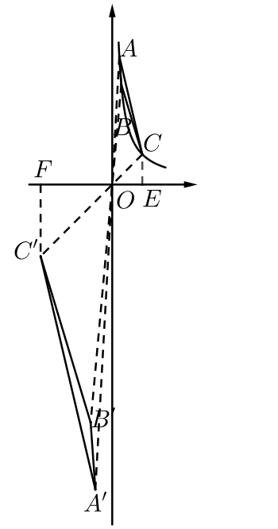

#### 7

第一步，求水平距离。设无人机位置为$P$，其在地面的投影为$P'$。在直角三角形$PP'O$中，已知高度$PP'=120$，俯角$\angle POP'=\alpha$，所以水平总距离为

$$
OP'=\frac{120}{\tan\alpha}.
$$

第二步，求向南飞行的距离。在地面上的直角三角形中：

1. 斜边为$OP'$；
2. 向南飞行的距离为偏航角$\beta$的邻边。

根据余弦定义，

$$
\text{向南飞行的距离}
=OP'\cos\beta
=\frac{120}{\tan\alpha}\cos\beta
=\frac{120\cos\beta}{\tan\alpha}.
$$

故选B。

#### 8

因为

$$
S_{\triangle COD}=\frac12 OC\cdot CD,
$$

而

$$
S_{\text{扇形 }COB}
=\frac12 OC\cdot\overset{\frown}{CB},
$$

又有$CD=\overset{\frown}{CB}$，所以

$$
S_{\triangle COD}=S_{\text{扇形 }COB}.
$$

从两边分别减去$S_{\text{扇形 }COE}$，得

$$
S_{\triangle COD}-S_{\text{扇形 }COE}
=S_{\text{扇形 }COB}-S_{\text{扇形 }COE}.
$$

即

$$
S_{\text{阴影}}=S_{\text{扇形 }EOB}=\frac{\pi}{3}.
$$

于是

$$
\begin{aligned}
S_{\text{扇形 }AOB}
&=S_{\text{扇形 }AOE}+S_{\text{扇形 }EOB}\\
&=\pi+\frac{\pi}{3}\\
&=\frac{4\pi}{3}.
\end{aligned}
$$

故选C。

#### 9

寻找点$I$的轨迹。作正三角形$\triangle GAJ$与$\triangle GBK$。

因为

$$
\angle AGJ=\angle BGK,
$$

所以

$$
\angle AGJ-\angle BGJ=\angle BGK-\angle BGJ,
$$

即$\angle AGB=\angle JGK$。

在$\triangle AGB$与$\triangle JGK$中，

$$
\begin{cases}
AG=GJ,\\
\angle AGB=\angle JGK,\\
GB=GK,
\end{cases}
$$

所以$\triangle AGB\cong\triangle JGK$。当$H$在$AB$上运动时，$I$在$JK$上运动。

过点$J$作$l\parallel ED$，过点$K$作$KQ\perp GB$，交$GB$于点$Q$。因为$GK=KB$，$\angle GKB=60^\circ$，$KQ\perp GB$，所以

$$
\angle GKQ=30^\circ.
$$

进而

$$
\angle QKJ=\angle GKJ-\angle GKQ=60^\circ.
$$

因为$l\parallel ED\parallel KQ$，所以

$$
\angle1=\angle QKJ=60^\circ.
$$

其余轨迹同理可得，点$I$的轨迹$JKLMNP$为正六边形，且$JP\parallel AO$。

连接$AO$、$BO$。$\triangle AOB$与$\triangle GAJ$均为等边三角形，易证

$$
\triangle AOJ\cong\triangle ABG.
$$

所以

$$
\angle AOJ=\angle ABG=90^\circ,
$$

$OJ$即为最小值，且

$$
OJ=GB=2\sqrt3.
$$

连接$EO$、$OD$。$\triangle EOD$与$\triangle GDM$均为等边三角形，$OM$即为最大值，且

$$
\triangle ODM\cong\triangle EDG.
$$

在直角三角形$GDE$中，

$$
GE=OM=\sqrt{GD^2+ED^2}=2\sqrt7.
$$

故选A。

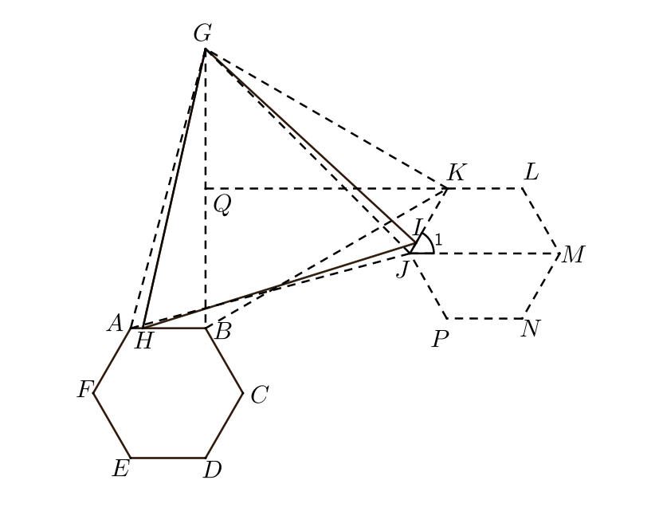

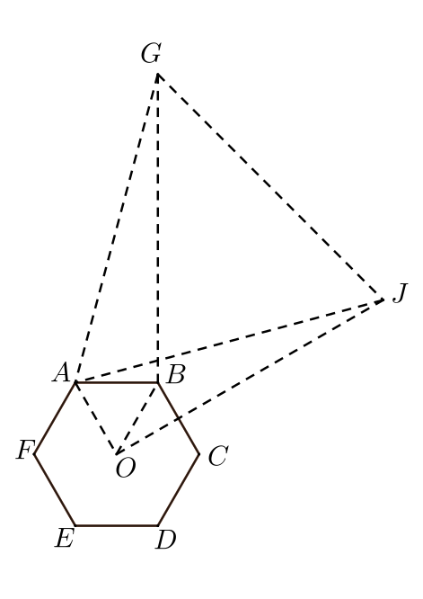

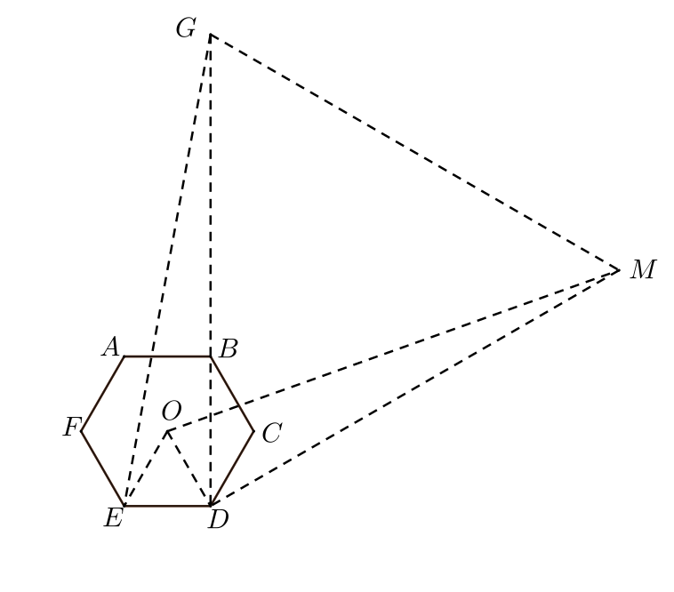

#### 10

在$AB$上取点$F$，使$\angle BFC=45^\circ$。

因为$\angle AEB=135^\circ$，所以

$$
\angle BEC=\angle BFC=45^\circ,
$$

从而

$$
\angle AEB=\angle AFC=135^\circ.
$$

在$\triangle AEB$与$\triangle AFC$中，

$$
\begin{cases}
\angle BAE=\angle FAC,\\
\angle AEB=\angle AFC,
\end{cases}
$$

所以$\triangle AEB\sim\triangle AFC$，于是

$$
\frac{AE}{AF}=\frac{AB}{AC},
$$

即

$$
AE\cdot AC=AB\cdot AF=4.
$$

连接$CF$。过点$D$作$DG\perp CF$，交$CF$于点$G$；过点$C$作$CH\perp AB$，交$AB$于点$H$。

因为$DG\perp FC$，$\angle DFC=45^\circ$，所以

$$
\angle FGD=90^\circ,\qquad \angle FDG=45^\circ.
$$

又因为$\angle ADC=75^\circ$，所以

$$
\angle GDC=\angle FDC-\angle FDG=30^\circ.
$$

在直角三角形$DGC$中，$\angle DGC=90^\circ$，$\angle GDC=30^\circ$。设$GC=k$，则

$$
DG=\sqrt3k.
$$

在直角三角形$FGD$中，$\angle GFD=45^\circ$，$\angle FGD=90^\circ$，所以

$$
FG=DG=\sqrt3k,\qquad DF=\sqrt6k.
$$

由三角形面积公式，

$$
S_{\triangle DFC}
=\frac12 CF\cdot DG
=\frac12 DF\cdot CH,
$$

故

$$
\frac{\sqrt3(\sqrt3+1)k^2}{2}
=\frac{\sqrt6k\cdot CH}{2}.
\tag{1}
$$

又

$$
S_{\triangle ABC}
=\frac12 AB\cdot CH
=3+\sqrt3.
\tag{2}
$$

由式$(1)$、$(2)$得

$$
k\cdot AB=2\sqrt6.
$$

所以

$$
DF\cdot AB=\sqrt6k\cdot AB=12.
$$

最终

$$
\begin{aligned}
AD\cdot AB
&=(AF+FD)\cdot AB\\
&=AF\cdot AB+FD\cdot AB\\
&=4+12\\
&=16.
\end{aligned}
$$

故选A。

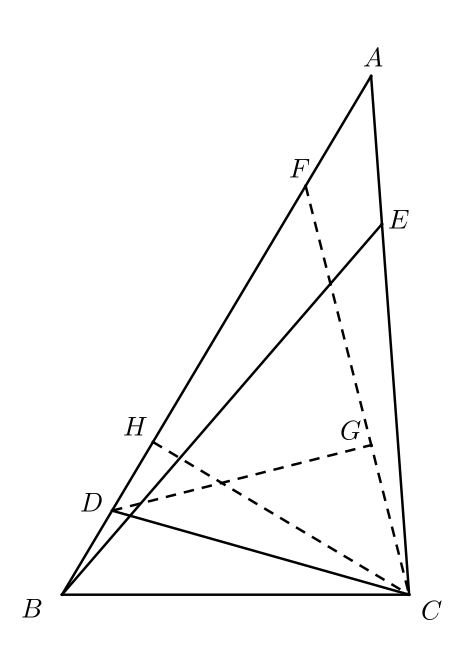

### 二、填空题

#### 11

原式

$$
\begin{aligned}
5(3m-2)-3(5m-7)
&=15m-10-15m+21\\
&=-10+21\\
&=11.
\end{aligned}
$$

故答案为$11$。

#### 12

因为

$$
\angle A+\angle B=3\angle C,
$$

且

$$
\angle A+\angle B+\angle C=180^\circ,
$$

所以

$$
\angle A+\angle B+\angle C=4\angle C=180^\circ.
$$

因此

$$
\angle C=45^\circ.
$$

#### 13

过点$A$作$AE\perp BC$，交$BC$于点$E$；过点$D$作$DF\perp AE$，交$AE$于点$F$；过点$B$作$BG\perp AD$，交$AD$于点$G$。

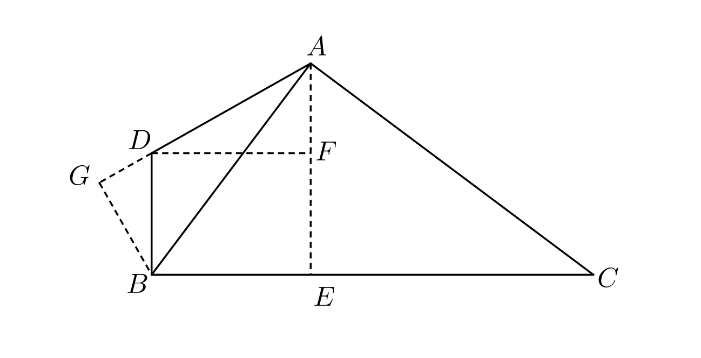

因为

$$
\angle BAE+\angle EAC=90^\circ,
$$

且

$$
\angle EAC+\angle ACE=90^\circ,
$$

所以

$$
\angle BAE=\angle ACE.
$$

在直角三角形$BAE$中，设$BA=3$，且

$$
\tan\angle BAE=\frac34.
$$

则

$$
BE=\frac95,\qquad EA=\frac{12}{5}.
$$

因为

$$
\angle ADF=\angle BDA-\angle BDF=30^\circ,
$$

且$DF=BE=\dfrac95$，所以在直角三角形$ADF$中，

$$
AF=\frac{3\sqrt3}{5},\qquad DA=\frac{6\sqrt3}{5}.
$$

于是

$$
DB=\frac{12-3\sqrt3}{5}.
$$

再将边长放大为原来的$10$倍，得

$$
DA=12\sqrt3,\qquad BD=24-6\sqrt3.
$$

在直角三角形$DBG$中，

$$
\angle GDB=180^\circ-\angle BDA=60^\circ,
$$

所以

$$
GD=12-3\sqrt3,\qquad GB=12\sqrt3-9.
$$

在直角三角形$BGA$中，

$$
\tan\angle DAB=\frac{GB}{GA}.
$$

因此

$$
\begin{aligned}
\tan\angle DAB
&=\frac{12\sqrt3-9}{12+9\sqrt3}\\
&=\frac{4\sqrt3-3}{4+3\sqrt3}\\
&=\frac{48-25\sqrt3}{11}.
\end{aligned}
$$

#### 14

延长$CD$，交$AB$于点$E$。

设

$$
\angle BAD=\angle DBC=\alpha,
$$

则

$$
\angle DCB=90^\circ-2\alpha.
$$

因为$\angle ABC=90^\circ$，所以

$$
\angle CEB=2\alpha.
$$

又因为

$$
\angle CEB=\angle EAD+\angle ADE,
$$

所以

$$
\angle ADE=\angle DAE=\alpha,\qquad AE=ED.
$$

因为

$$
\angle DBE=\angle EBC-\angle DBC=90^\circ-\alpha,
$$

所以

$$
\angle EDB=\angle DBE=90^\circ-\alpha,
$$

从而

$$
DE=EB.
$$

于是$AE=EB$。

又因为

$$
\angle ADB=180^\circ-\angle DAB-\angle DBA=90^\circ,
$$

所以

$$
DE=\frac12 AB=1.
$$

在直角三角形$CBE$中，

$$
CE=\sqrt{CB^2+BE^2}=\sqrt{17}.
$$

因此

$$
DC=CE-DE=\sqrt{17}-1.
$$

#### 15

原分式方程为

$$
(x-m)(x+4)+(2x+m)(x-2)=4(x+4)(x-2).
$$

化简得

$$
x^2+8x-32+6m=0,
$$

其对称轴为直线$x=-4$。

当此方程仅有负数根时，分两种情况。

第一种情况：

$$
\begin{cases}
x\neq2,\\
x\neq-4,\\
\Delta\geq0,\\
f(0)>0.
\end{cases}
$$

解得

$$
\frac{16}{3}<m<8.
$$

第二种情况：

$$
f(2)=0,
$$

解得$m=2$。此时二次方程有两个根，但对原分式方程而言，$x=2$是增根，必须舍去，故原分式方程仅有负根。

题设命题要求为假，因此取上述范围的补集，得到

$$
m<2,
$$

或

$$
2<m\leq\frac{16}{3},
$$

或

$$
m\geq8.
$$

#### 16

将$\triangle BAC$旋转至$\triangle DAE$。过点$A$作$AF\perp CE$，交$CE$于点$F$；过点$D$作$DG\perp CE$，交$CE$于点$G$；过点$D$作$DH\perp AF$，交$AF$于点$H$。

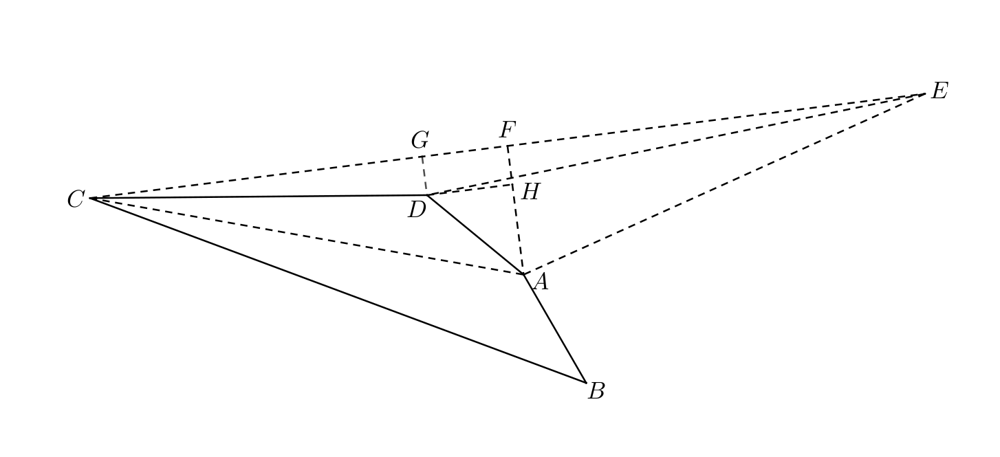

因为

$$
\triangle BAC\cong\triangle DAE,
$$

所以

$$
CA=AE.
$$

又因为$AF\perp CE$，所以

$$
CF=FE.
$$

设

$$
GF=y,\qquad FE=x,
$$

则

$$
CG=CF-GF=FE-GF=x-y.
$$

在直角三角形$CGD$中，

$$
GD^2=CD^2-CG^2=7^2-(x-y)^2.
$$

在直角三角形$EGD$中，

$$
GD^2=DE^2-GE^2=11^2-(x+y)^2.
$$

因此

$$
7^2-(x-y)^2=11^2-(x+y)^2,
$$

化简得

$$
xy=18.
$$

四边形$ABCD$的面积满足

$$
\begin{aligned}
S_{ABCD}
&=S_{\triangle CDA}+S_{\triangle ADE}\\
&=S_{\triangle CAE}-S_{\triangle CDE}\\
&=\frac12 CE\cdot AF-\frac12 CE\cdot GD\\
&=\frac12 CE\cdot(AF-GD)\\
&=\frac12 CE\cdot HA.
\end{aligned}
$$

当$C,D,E$三点共线时，$CE$取到最大值，即$2x$取到最大值。因为$xy=18$，所以此时$y$取到最小值。

在直角三角形$DHA$中，

$$
DA=\sqrt7,\qquad DH=y,
$$

从而

$$
HA=\sqrt{DA^2-DH^2}=\sqrt{7-y^2}.
$$

此时$HA$取到最大值，所以$S_{ABCD}$取到最大值。

在这一极值位置，$G,D$重合，$F,H$重合，且

$$
CE=CD+DE=18.
$$

因为$CA=AE$，$AF\perp CE$，所以

$$
CF=FE=\frac12 CE=9.
$$

又因为$CD=7$，所以

$$
DF=CF-CD=2.
$$

在直角三角形$DFA$中，

$$
FA=\sqrt{DA^2-DF^2}=\sqrt3.
$$

在直角三角形$CFA$中，

$$
CA=\sqrt{FA^2+CF^2}=2\sqrt{21}.
$$

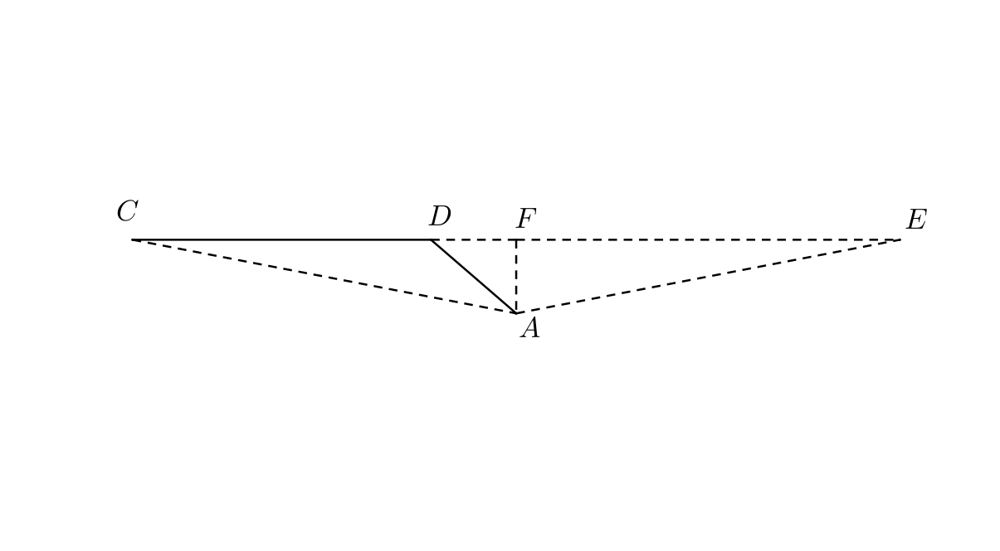

### 三、解答题

#### 17

遇到平方减平方的式子，可以使用平方差公式。原式

$$
x^2-16=(x+4)(x-4).
$$

#### 18

原不等式组为

$$
\begin{cases}
3x+8\leq29, & \text{①}\\
-2x+7<-1. & \text{②}
\end{cases}
$$

由①得

$$
3x\leq21,
$$

所以

$$
x\leq7.
$$

由②得

$$
-2x<-8,
$$

所以

$$
x>4.
$$

因此，原不等式组的解集为

$$
4<x\leq7.
$$

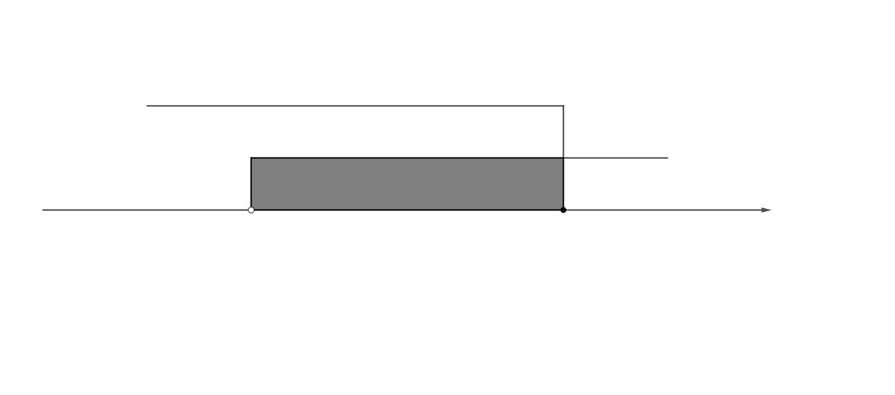

#### 19

##### （1）

$$
15\times60=900\ \text{（秒）}.
$$

因此第一人的路程与时间的函数关系为

$$
l_1:s=4t\qquad(0\leq t\leq900).
$$

设第二人的函数关系为

$$
l_2:s=3t+b.
$$

当

$$
t=60\times2=120
$$

时，$s=0$，所以

$$
120\times3+b=0,
$$

解得

$$
b=-360.
$$

因此

$$
l_2:s=3t-360\qquad(120\leq t\leq900).
$$

##### （2）

两人的路程差为

$$
\Delta s=4t-(3t-360)=t+360.
$$

当$t=900$时，

$$
\Delta s=900+360=1260.
$$

又

$$
1260\div400=3\mathbin{\ldots\ldots}60,
$$

所以共套圈$3$次。

#### 20

##### （1）

上升支的平均膜电位变化速率为

$$
\frac{40-(-70)}{0.4}=275\ \mathrm{mV/ms}.
$$

##### （2）

五个峰值的平均值为

$$
\begin{aligned}
\overline{x}
&=\frac15\left[(-60)+(-65)+(-56)+(-68)+(-61)\right]\\
&=-62\ \mathrm{mV}.
\end{aligned}
$$

方差为

$$
\begin{aligned}
S^2
&=\frac15\Bigl\{
\left[(-60)-(-62)\right]^2
+\left[(-65)-(-62)\right]^2\\
&\qquad
+\left[(-56)-(-62)\right]^2
+\left[(-68)-(-62)\right]^2
+\left[(-61)-(-62)\right]^2
\Bigr\}\\
&=17.2.
\end{aligned}
$$

##### （3）

所求函数为

$$
y=
\begin{cases}
0, & 0\leq x<0.5,\\
1, & x\geq0.5.
\end{cases}
$$

#### 21

以下沿用题目定义的「净尾数」记号$/a/$。

##### （1）

因为

$$
|-15|-10\times1=5,
$$

且

$$
0<5<9,
$$

所以

$$
/{-15}/=5.
$$

##### （2）

由题意，

$$
m-61-\frac{2176}{17}=97+63,
$$

即

$$
m-61-128=97+63.
$$

按净尾数化简，

$$
/{m-1-8}/=/{7+3}/,
$$

所以

$$
/{m-9}/=0,
$$

从而

$$
/m/=9.
$$

也可直接解得$m=349$，并验证

$$
|349|-10\times34=9.
$$

##### （3）

小明的解答错误，具体有两处：

1. 「$/{-7x+70}/=2$」应为「$/{-7x+70}/=1$」；
2. 「$/{-7x}/=1$」应为「$/{-7x}/=9$」。

正确解答如下。

由②得

$$
y=8-x.
\tag{3}
$$

因为$x,y$均为正整数，所以

$$
\begin{cases}
x>0,\\
8-x>0.
\end{cases}
$$

解得

$$
0<x<8.
$$

由①得

$$
/{2x+9y}/=3.
\tag{4}
$$

把式$(3)$代入式$(4)$，得

$$
/{2x+9(8-x)}/=3,
$$

即

$$
/{2x+72-9x}/=3,
$$

所以

$$
/{-7x+72}/=3.
$$

进一步得到

$$
/{-7x+70}/=1.
$$

因为$-7x<0$，所以

$$
/{-7x}/=9.
$$

在$0<x<8$的正整数范围内枚举，得

$$
x=7.
$$

于是

$$
y=8-x=1.
$$

因此原方程组的正整数解为

$$
(x,y)=(7,1).
$$

规避此类错误时，应优化代入方式，使代数表达式尽可能保持非负、系数为正。合理运用简化策略与结构洞察时，应做到：

1. 先审视工具适用的前提，准确理解概念；
2. 抓住问题的特殊性，调整表达形式并重视细节；
3. 最后再应用简化策略，同时用原方程检验结果，避免逻辑漏洞。

#### 22

##### （1）

因为四边形$ABCD$为长方形，所以

$$
\angle BAE=\angle ABA'=90^\circ.
$$

由折叠的性质，

$$
\angle BAE=\angle BA'E=90^\circ.
$$

因此

$$
\angle AEA'
=360^\circ-\angle ABA'-\angle BAE-\angle BA'E
=90^\circ.
$$

所以

$$
\angle ABA'=\angle BA'E=\angle A'EA=\angle EAB=90^\circ,
$$

四边形$ABA'E$为矩形。

又由折叠的性质，$BA=BA'$，所以四边形$ABA'E$为正方形。

##### （2）

第一种情况如下图。四边形$ABCD$、$DEGH$均为正方形，四边形$ECFG$为矩形，且

$$
EC=2,\qquad CF=3.
$$

连接$AC$、$BD$，交于点$I$；连接$EF$、$CG$，交于点$J$；连接$AG$。

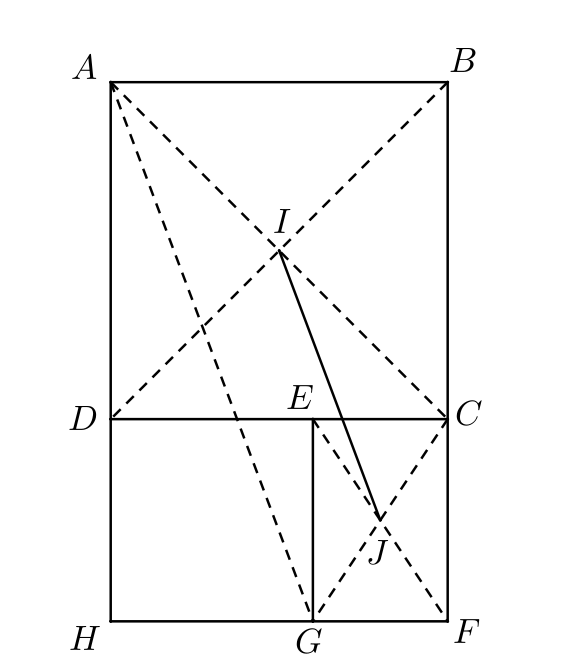

因为四边形$ABCD$为正方形，四边形$ECFG$为矩形，所以$I$为$CA$的中点，$J$为$CG$的中点。因此$IJ$为$\triangle CAG$的中位线，从而

$$
IJ\parallel AG,\qquad IJ=\frac12 AG.
$$

因为四边形$ECFG$为矩形，所以

$$
EG=CF=3,\qquad CE=GF=2.
$$

因为四边形$DEGH$为正方形，所以

$$
DE=EG=GH=DH=3,
$$

且

$$
\angle DHG=\angle HDE=90^\circ.
$$

于是

$$
DC=DE+EC=5.
$$

因为四边形$ABCD$为正方形，所以

$$
AD=DC=CB=BA=5,\qquad \angle ADC=90^\circ.
$$

又

$$
\angle ADC+\angle EDH=180^\circ,
$$

所以$A,D,H$三点共线，从而

$$
AH=AD+DH=8.
$$

在直角三角形$AHG$中，

$$
AH=8,\qquad HG=3,
$$

故

$$
AG=\sqrt{AH^2+HG^2}=\sqrt{73}.
$$

因此

$$
IJ=\frac12 AG=\frac{\sqrt{73}}{2}.
$$

第二种情况如下图。四边形$ABCD$、$EFDG$均为正方形，四边形$HAFE$为矩形，且

$$
HA=2,\qquad HE=3.
$$

连接$HF$、$AE$，交于点$I$；连接$AC$、$BD$，交于点$J$；连接$CE$。

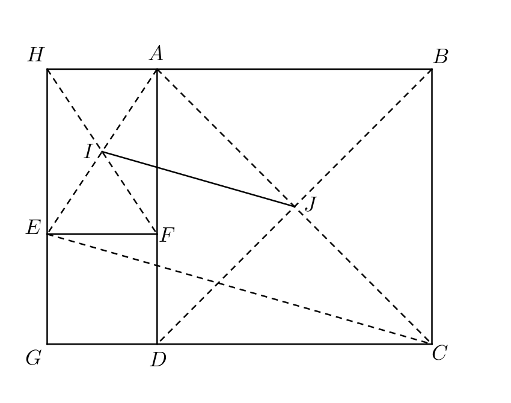

因为四边形$HAFE$为矩形，所以

$$
HA=EF=2,\qquad HE=AF=3.
$$

因为四边形$EFGD$为正方形，所以

$$
EF=GD=EG=FD=2,
$$

且

$$
\angle EDF=\angle GDF=90^\circ.
$$

于是

$$
AD=AF+FD=3+2=5.
$$

因为四边形$ABCD$为正方形，所以

$$
AD=DC=5,\qquad \angle ADC=90^\circ.
$$

又

$$
\angle ADC+\angle FDG=180^\circ,
$$

所以$G,D,C$三点共线，从而

$$
GC=GD+DC=2+5=7.
$$

因为四边形$HAFE$为矩形，四边形$ABCD$为正方形，所以$I$为$EA$的中点，$J$为$AC$的中点。因此$IJ$为$\triangle AEC$的中位线，从而

$$
IJ\parallel EC,\qquad IJ=\frac12 EC.
$$

在直角三角形$EGC$中，

$$
EG=2,\qquad GC=7,
$$

所以

$$
EC=\sqrt{EG^2+GC^2}=\sqrt{53}.
$$

因此

$$
IJ=\frac12 EC=\frac{\sqrt{53}}{2}.
$$

综上，$IJ$的长为

$$
\frac{\sqrt{73}}{2}
$$

或

$$
\frac{\sqrt{53}}{2}.
$$

##### （3）

由辗转相除法，

$$
\begin{aligned}
18272\div384&=47\mathbin{\ldots\ldots}224,\\
384\div224&=1\mathbin{\ldots\ldots}160,\\
224\div160&=1\mathbin{\ldots\ldots}64,\\
160\div64&=2\mathbin{\ldots\ldots}32,\\
64\div32&=2.
\end{aligned}
$$

每一步商的总和为

$$
47+1+1+2+2=53,
$$

所以一共可以剪出$53$个正方形。

一般地，先将原长方形放大为原来的$q_1q_2$倍，则其长、宽分别变为

$$
p_1q_2,\qquad p_2q_1.
$$

因为最终产生的正方形边长为长与宽的最大公因数，所以放大后最终得到的正方形边长为

$$
\gcd(p_1q_2,p_2q_1).
$$

再将长度缩小为原来的$\dfrac{1}{q_1q_2}$，可得原长方形最终得到的正方形边长为

$$
\frac{\gcd(p_1q_2,p_2q_1)}{q_1q_2}.
$$

#### 23

##### （1）（i）

因为$x_1=1$，所以

$$
A(1,0),\qquad OA=1.
$$

又因为

$$
OA=\frac14 OB,
$$

所以

$$
OB=4.
$$

点$B$在$x$轴正半轴上，因此

$$
B(4,0).
$$

二次函数的二次项系数为$a=3$，且图像经过$A(1,0)$、$B(4,0)$，所以

$$
\begin{aligned}
y
&=3(x-1)(x-4)\\
&=3x^2-15x+12.
\end{aligned}
$$

##### （1）（ii）

直线$y'=mx+n$与抛物线交于$C$、$D$两点，因此

$$
3x^2-15x+12=mx+n,
$$

即

$$
3x^2+(-15-m)x+(12-n)=0.
\tag{5}
$$

由根与系数的关系，

$$
x_3+x_4=-\frac{-15-m}{3}=\frac{15+m}{3}.
\tag{6}
$$

因为$CP=DP$，所以$P$为$CD$的中点，故

$$
\frac{x_3+x_4}{2}=x_P=3.
\tag{7}
$$

由式$(6)$、$(7)$解得

$$
m=3.
$$

当$x=3$时，

$$
y'=3\times3+n=p,
$$

所以

$$
n=p-9.
$$

将$m=3$、$n=p-9$代入式$(5)$，得

$$
3x^2-18x+(21-p)=0.
$$

因为直线与抛物线交于两个不同的点，所以

$$
\Delta=18^2-4\cdot3(21-p)>0.
$$

解得

$$
p>-6.
$$

因此

$$
y'=3x+p-9,\qquad p>-6.
$$

##### （2）

设抛物线为

$$
y=f(x)=ax^2+bx+c,
$$

直线$l$为

$$
l:y=ix+j.
$$

作$l_0\parallel l$，使$l_0$与抛物线相切于点$E(x_5,y_5)$，设

$$
l_0:y=ix+k.
$$

联立$l$与抛物线：

$$
ix+j=ax^2+bx+c,
$$

化简得

$$
ax^2+(b-i)x+(c-j)=0.
$$

因此

$$
x_1+x_2=-\frac{b-i}{a}.
\tag{8}
$$

联立$l_0$与抛物线：

$$
ix+k=ax^2+bx+c,
$$

化简得

$$
ax^2+(b-i)x+(c-k)=0.
$$

因为$l_0$与抛物线相切，横坐标$x_5$是二重根，所以

$$
x_5+x_5=-\frac{b-i}{a}.
\tag{9}
$$

由式$(8)$、$(9)$得

$$
x_5=\frac{x_1+x_2}{2}.
$$

又因为

$$
y_3=\frac{y_1+y_2}{2},
$$

所以

$$
\begin{aligned}
y_3-f\left(\frac{x_1+x_2}{2}\right)
&=\frac{y_1+y_2}{2}-f\left(\frac{x_1+x_2}{2}\right)\\
&=\frac{f(x_1)+f(x_2)}{2}-f\left(\frac{x_1+x_2}{2}\right)\\
&=\frac12\left[(ax_1^2+bx_1+c)+(ax_2^2+bx_2+c)\right]\\
&\qquad-\left[a\left(\frac{x_1+x_2}{2}\right)^2
+b\left(\frac{x_1+x_2}{2}\right)+c\right]\\
&=\left[a\left(\frac{x_1^2+x_2^2}{2}\right)
+b\left(\frac{x_1+x_2}{2}\right)+c\right]\\
&\qquad-\left[a\left(\frac{x_1+x_2}{2}\right)^2
+b\left(\frac{x_1+x_2}{2}\right)+c\right]\\
&=a\left[\frac{x_1^2+x_2^2}{2}
-\left(\frac{x_1+x_2}{2}\right)^2\right]\\
&=\frac14a(x_1-x_2)^2.
\end{aligned}
$$

因为$A$、$B$是两个不重合的点，所以

$$
x_1\neq x_2,
$$

从而

$$
(x_1-x_2)^2>0.
$$

在已经证明

$$
x_5=\frac{x_1+x_2}{2}
$$

和

$$
y_3-f\left(\frac{x_1+x_2}{2}\right)
=\frac14a(x_1-x_2)^2
$$

之后，可以用以下两种方法完成证明。

**方法一：根据开口方向判断。**

1. 当$a>0$时，

   $$
   y_3-f\left(\frac{x_1+x_2}{2}\right)>0.
   $$

   结合图像可知，$l$与抛物线必有两个交点。

2. 当$a<0$时，

   $$
   y_3-f\left(\frac{x_1+x_2}{2}\right)<0.
   $$

   结合图像可知，$l$与抛物线同样必有两个交点。

**方法二：反证。**

1. 假设$l$与抛物线没有交点。因为

   $$
   y_3=\frac{y_1+y_2}{2},
   $$

   结合图像可知，抛物线不可能与$l$没有交点，与假设矛盾。

2. 假设$l$与抛物线仅有一个交点，则$l$为切线，且切点横坐标为$\dfrac{x_1+x_2}{2}$，于是

   $$
   y_3-f\left(\frac{x_1+x_2}{2}\right)
   =0
   =\frac14a(x_1-x_2)^2.
   $$

   因为$a\neq0$，所以$x_1=x_2$，这与$A$、$B$为两个不重合的点矛盾。

综上，直线$l$一定与抛物线有两个交点。

#### 24

##### （1）

连接$OD$、$OA$。

因为

$$
OF=OD=OA,\qquad DA=\sqrt2\,OF,
$$

所以

$$
DA=\sqrt2\,OF=\sqrt2\,OD=\sqrt2\,OA,
$$

从而

$$
DA^2=OD^2+OA^2.
$$

由勾股定理的逆定理，

$$
\angle DOA=90^\circ.
$$

因此

$$
\angle ABD=\frac12\angle DOA=45^\circ.
$$

因为$AB\parallel CD$，$AE\perp CD$，所以$AE\perp AB$，从而

$$
\angle FAB=90^\circ.
$$

于是

$$
\angle AHB=\angle DHE=45^\circ.
$$

因为四边形$DIKJ$为平行四边形，所以

$$
DI\parallel JK,\qquad DI=JK.
$$

因此

$$
\angle DHE=\angle HJK=45^\circ.
$$

又因为$JL\perp AJ$，所以

$$
\angle LJA=90^\circ,
$$

进而

$$
\angle KJL=\angle LJA-\angle HJK=45^\circ.
$$

因为$JK=KL$，所以

$$
\angle KJL=\angle KLJ=45^\circ,
$$

且

$$
\angle JKL=90^\circ.
$$

因为$CI\perp BD$，所以

$$
\angle DIC=90^\circ.
$$

又因为$AB\parallel CD$，所以

$$
\angle ABD=\angle BDC=45^\circ,
$$

从而

$$
\angle ICD=45^\circ.
$$

在$\triangle JKL$与$\triangle DIC$中，

$$
\begin{cases}
\angle KJL=\angle IDC=45^\circ,\\
JK=DI,\\
\angle JKL=\angle DIC=90^\circ.
\end{cases}
$$

所以

$$
\triangle JKL\cong\triangle DIC
$$

（ASA）。

##### （2）

因为$CD\perp AF$，所以

$$
\angle DEJ=90^\circ.
$$

于是

$$
\angle EDJ+\angle DJE=90^\circ.
$$

结合前面所得的角关系，

$$
\angle CDJ+\angle DJE+\angle HJK+\angle KJL=180^\circ.
$$

所以

$$
\angle CDJ+\angle DJL=180^\circ,
$$

从而

$$
JL\parallel DC.
$$

因此四边形$JLCD$为平行四边形，故

$$
LB\parallel JD.
$$

设

$$
\angle BCI=\alpha,
$$

则

$$
\angle IBC=90^\circ-\alpha.
$$

因为$A,B,C,D$四点共圆，所以

$$
\angle ABC+\angle ADC=180^\circ.
$$

由此得到

$$
\angle ADC=45^\circ+\alpha=\angle DCB.
$$

因为$JD\parallel BL$，所以

$$
\angle BCD=\angle JDC.
$$

于是

$$
\angle JDC=\angle CDA.
$$

因此

$$
90^\circ-\angle JDC=90^\circ-\angle CDA,
$$

即

$$
\angle DJE=\angle DAE.
$$

从而

$$
JD=DA.
$$

又因为

$$
\angle ABD=\angle BDC,
$$

所以

$$
DA=BC.
$$

因为四边形$JDIK$为平行四边形，所以

$$
JD=KI.
$$

因为四边形$JDCL$为平行四边形，所以

$$
JD=CL.
$$

连接$FB$。因为

$$
\angle FAB=90^\circ,
$$

所以$FB$为圆$O$的直径，且

$$
FB=2OF=OF+OB.
$$

因此$F,O,B$三点共线。

连接$FL$、$FC$。因为$FB$为直径，所以

$$
\angle FCB=90^\circ.
$$

于是

$$
\angle FCD=\angle FCB-\angle DCB=45^\circ-\alpha.
$$

又有

$$
\angle FCD=\angle DBF=45^\circ-\alpha,
$$

所以

$$
\angle FBC=\angle DBC-\angle DBF=45^\circ.
$$

因此

$$
\angle CFB=\angle CBF=45^\circ,
$$

从而

$$
CF=CB.
$$

因为

$$
\angle FCL=90^\circ,\qquad FC=CL,
$$

所以

$$
\angle CFL=\angle CLF=45^\circ.
$$

进而

$$
\angle FLB=\angle FBL=45^\circ,\qquad \angle LFB=90^\circ.
$$

设

$$
FL=FB=2x=2OF,
$$

则$OF=x$。

连接$OL$。在直角三角形$OLF$中，

$$
OL=\sqrt{OF^2+FL^2}=\sqrt5x.
$$

在直角三角形$FLB$中，

$$
BL=\sqrt{FL^2+FB^2}=2\sqrt2x.
$$

又因为$KI=CL=CB$，所以

$$
\begin{aligned}
KI
&=\frac12\cdot2KI\\
&=\frac12(LC+CB)\\
&=\frac12BL\\
&=\sqrt2x.
\end{aligned}
$$

因此

$$
\frac{KI}{OL}
=\frac{\sqrt2x}{\sqrt5x}
=\frac{\sqrt{10}}{5}.
$$

##### （3）

由前文已证

$$
\angle AHB=45^\circ,
$$

所以

$$
\angle FHB=135^\circ.
$$

于是

$$
\angle FHB+\angle FLB=180^\circ,
$$

故$F,H,B,L$四点共圆。

因此

$$
\angle FHL=\angle FBL=45^\circ.
$$

又因为

$$
\angle JHL+\angle JLK+\angle LJH=180^\circ,
$$

所以$L,K,H$三点共线。

连接$LD$、$GL$。因为

$$
\angle JLH=45^\circ
=\angle FLJ+\angle FLD+\angle DLH,
$$

且

$$
\angle FLC
=\angle DLH+\angle HLC+\angle FLD
=45^\circ,
$$

所以

$$
\angle FLJ+\angle DLH
=\angle DLH+\angle HLC
=\angle DLC.
\tag{10}
$$

为了证明$\angle DLC=\angle CGL$，有以下两种方法。

**方法一：利用相似三角形。**

在$\triangle GBC$与$\triangle BDC$中，

$$
\begin{cases}
\angle GCB=\angle DCB,\\
\angle GBC=\angle BDC,
\end{cases}
$$

所以

$$
\triangle GBC\sim\triangle BDC.
$$

因此

$$
\frac{BC}{CG}=\frac{DC}{BC}.
$$

又因为

$$
BC=CL,
$$

所以

$$
\frac{CL}{CG}=\frac{DC}{CL}.
$$

在$\triangle CLG$与$\triangle CDL$中，

$$
\begin{cases}
\dfrac{CL}{CG}=\dfrac{DC}{CL},\\
\angle LCG=\angle DCL,
\end{cases}
$$

所以

$$
\triangle CLG\sim\triangle CDL.
$$

因此

$$
\angle CGL=\angle CLD=\angle DLC.
$$

结合式$(10)$，得

$$
\angle CGL=\angle FLJ+\angle DLH.
$$

而$\angle DLH=\angle HLD$，所以

$$
\boxed{\angle CGL=\angle HLD+\angle FLJ}.
$$

**方法二：先证明另一组三角形相似。**

因为$FL=FB$，所以

$$
\frac{FG}{FL}=\frac{FG}{FB}.
$$

又因为$DC\parallel AB$，所以

$$
\frac{FG}{FB}=\frac{EF}{FA}.
$$

从而

$$
\frac{FG}{FL}=\frac{EF}{FA}.
\tag{11}
$$

在$\triangle DEH$与$\triangle HJL$中，

$$
\begin{cases}
\angle DEH=\angle HJL=90^\circ,\\
\angle EDH=\angle JHL=45^\circ,
\end{cases}
$$

所以

$$
\triangle DEH\sim\triangle HJL.
$$

因此

$$
\frac{DH}{HL}=\frac{EH}{JH}.
\tag{12}
$$

连接$DF$。因为$FB$为直径，所以

$$
\angle FDB=90^\circ.
$$

进而

$$
\angle DFH=\angle DHF=45^\circ,
$$

所以

$$
DF=DH.
$$

因为$DC\perp AF$，所以

$$
EF=EH.
$$

于是

$$
\frac{EH}{JH}=\frac{EF}{JH}.
$$

又因为$DJ=DA$，$DC\perp JA$，所以

$$
JE=EA.
$$

因此

$$
JE-FE=EA-EH,
$$

即

$$
JF=HA.
$$

所以

$$
JF+FH=HA+AF,
$$

从而

$$
JH=AF.
$$

于是

$$
\frac{EF}{JH}=\frac{EF}{AF}.
$$

结合式$(12)$，得

$$
\frac{DH}{HL}=\frac{EF}{AF}.
\tag{13}
$$

由式$(11)$、$(13)$，

$$
\frac{FG}{FL}=\frac{DH}{HL}.
$$

在$\triangle LFG$与$\triangle LHD$中，

$$
\begin{cases}
\dfrac{GF}{FL}=\dfrac{DH}{HL},\\
\angle LFG=\angle DHL=90^\circ,
\end{cases}
$$

所以

$$
\triangle LFG\sim\triangle LHD.
$$

因此

$$
\angle FGL=\angle HDL.
$$

又

$$
\begin{aligned}
\angle FGL
&=\angle FBL+\angle BLG\\
&=45^\circ+\angle BLG,
\end{aligned}
$$

且

$$
\begin{aligned}
\angle HDL
&=\angle HDC+\angle LDC\\
&=45^\circ+\angle LDC.
\end{aligned}
$$

所以

$$
\angle LDC=\angle BLG.
$$

由此同样可以证明

$$
\triangle CLG\sim\triangle CDL,
$$

余下步骤与方法一相同，最终得到

$$
\boxed{\angle CGL=\angle HLD+\angle FLJ}.
$$

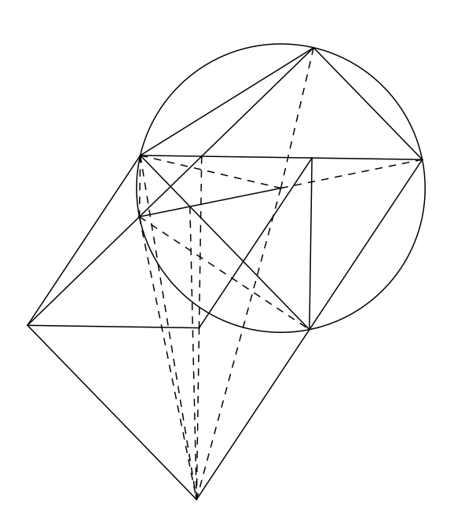

