
<strong>机密★启用前</strong>

<h1 align="center">浙江省2026年初中学业水平模拟考试</h1>

<h2 align="center">数学</h2>

| 姓名 | 准考证号 | 座位号 |
| :---: | :---: | :---: |
|  |  |  |

### 考生注意

1. 本试题卷分选择题和非选择题两部分，共8页，满分120分，考试时间120分钟。
2. 答题前，请务必将自己的姓名、准考证号用黑色字迹的签字笔或钢笔分别填写在试题卷和答题纸规定的位置上。
3. 答题时，请按照答题纸上「注意事项」的要求，在答题纸相应的位置上规范作答，在本试题卷上的作答一律无效。
4. 本次考试不允许使用计算器，没有近似计算要求的试题，结果都不能用近似数表示。

## 选择题部分

## 一、选择题

（本大题共10小题，每小题3分，共30分。每小题列出的四个选项中只有一个是符合题目要求的，不选、多选、错选均不得分）

### 1.

下列各数中是负数的是（　▲　）。

| A | B | C | D |
| :---: | :---: | :---: | :---: |
| $-7$ | $0$ | $9$ | 无法确定 |

### 2.

现有9张大小质感均一样的扑克牌，上面分别写有「学、数、学、学、思、维、学、方、法」这9个字，蔡老师从中任意抽取一张，抽到的卡片上面恰好写着「学」的概率为（　▲　）。

| A | B | C | D |
| :---: | :---: | :---: | :---: |
| $\frac{1}{9}$ | $\frac{2}{9}$ | $\frac{1}{3}$ | $\frac{4}{9}$ |

### 3.

科技不仅有高度，更有温度。2025年，温州理工学院的教师团队利用AI技术，成功「复活」了牺牲71年的烈士潘志民。通过修复珍贵的老照片，技术人员对烈士面部的每一个细节进行数字化重塑。已知AI模型在处理面部微表情时，需要捕捉像素间距仅为$0.000\,000\,25$米的微小变化，为了让烈士的音容笑貌更自然，算法进行了数亿次的迭代运算，最终实现了跨越时空的「云团圆」。其中数据「$0.000\,000\,25$」可以用科学记数法表示为（　▲　）。

| A | B | C | D |
| :---: | :---: | :---: | :---: |
| $2.5\times 10^{-6}$ | $2.5\times 10^{-7}$ | $0.25\times 10^{-6}$ | $0.25\times 10^{-7}$ |

### 4.

如图，根据图中的尺规作图痕迹，下列说法中不一定正确的是（　▲　）。

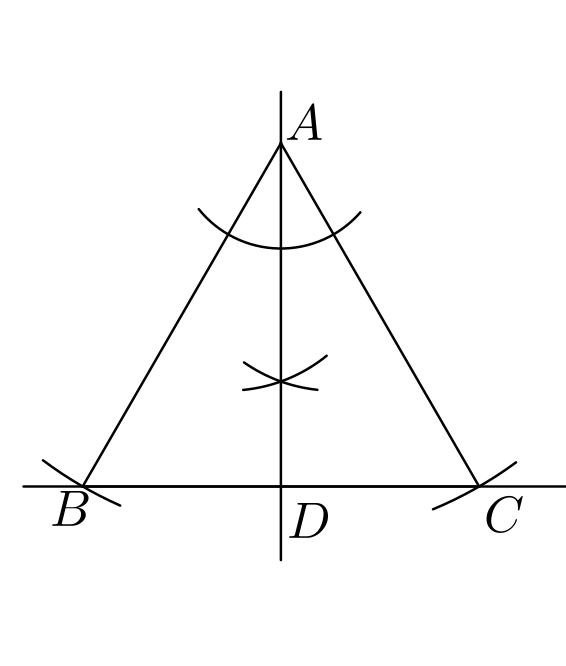

| A | B | C | D |
| :---: | :---: | :---: | :---: |
| $AD\perp BC$ | 点$D$是$BC$的中点 | $AD$平分$\angle BAC$ | $AB=BC$ |

### 5.

下列说法正确的有（　▲　）个。

1. $2^2+2^2=2^3$；
2. $(x^3)^3=x^9$；
3. $(x+y)^2=x^2+y^2$；
4. $\frac{\sqrt{-k^3}}{k}m=\frac{\sqrt{-k^3}}{k}n$可化简为$-\sqrt{-k}\,m=-\sqrt{-k}\,n$，则$m$一定等于$n$。

| A | B | C | D |
| :---: | :---: | :---: | :---: |
| $0$ | $1$ | $2$ | $3$ |

### 6.

如图，在平面直角坐标系$xOy$中，函数$y=\frac{8}{x}$（$x>0$）的图象上有三点$A$、$B$、$C$。已知$\triangle ABC$的面积为$2$，且$\triangle A'B'C'$是以坐标原点$O$为位似中心、与$\triangle ABC$位似的图形。若$\triangle A'B'C'$的面积为$8\sqrt{2}$，点$C'$关于$x$轴的对称点落在反比例函数$y=-\frac{k}{x}$的图象上，此时$k$的值为（　▲　）。

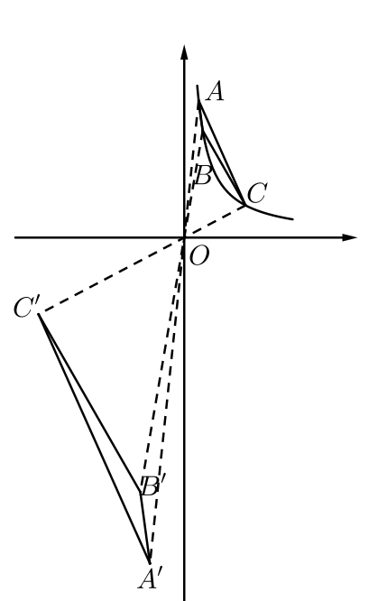

| A | B | C | D |
| :---: | :---: | :---: | :---: |
| $64$ | $-64$ | $32\sqrt{2}$ | $-32\sqrt{2}$ |

### 7.

某中学905班科学实验小组在楼老师的指导下，开展了以「利用无人机测量星星高度角」为主题的科学探究活动。为提高测量精度，小王同学进行了如下操作：

| 步骤 | 操作 |
| --- | --- |
| 建立参照 | 将无人机从地面点$O$垂直起飞至一定高度，并在$O$点放置一部开启手电筒的手机作为参照光源，随后继续操控无人机上升至距地面$120$米的空中。 |
| 水平飞行 | 无人机先向正南方向飞行一段距离，再向正东方向飞行一段距离，最终到达点$P$，使得站在$O$点的观察者恰好看到无人机遮挡住目标星星。 |
| 姿态调整 | 在点$P$处，调整无人机机身，使机头（云台摄像机安装于机头）朝向正北并锁定；此过程中云台摄像机未发生转动。 |
| 云台对准 | 保持机身不动，仅转动云台相机，将图传画面中心的十字线精确对准地面$O$点的灯光。 |

此时，操作界面显示云台参数如下：

| 参数 | 数值 |
| --- | :---: |
| 俯角（云台相机向下转动的角度，以水平为$0^\circ$） | $\alpha$ |
| 偏航角（云台相机水平转动的角度，向左为负，向右为正） | $-\beta$ |

作为小组成员，你负责数据处理。根据上述过程，可计算出该同学在「水平飞行」步骤中向南飞行的距离为（　▲　）。

| A | B | C | D |
| :---: | :---: | :---: | :---: |
| $120\tan\alpha\cos\beta$ | $\frac{120\cos\beta}{\tan\alpha}$ | $\frac{120\tan\alpha}{\cos\beta}$ | $\frac{120}{\tan\alpha\cos\beta}$ |

### 8.

如图，在扇形$AOB$中，半径为$2$，点$C$在弧$AB$上。过点$C$作弧$AB$所在圆的切线$CD$，使得$CD$的长度等于弧$CB$的长度。连接$OD$，交弧$CB$于点$E$。已知图中阴影部分的面积为$\frac{\pi}{3}$，且$\angle DOA=90^\circ$。则扇形$AOB$的面积为（　▲　）。

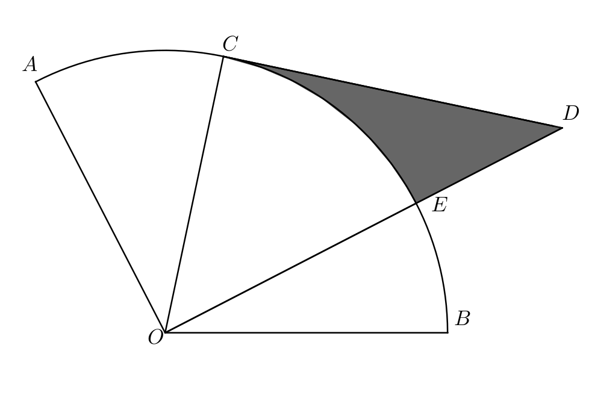

| A | B | C | D |
| :---: | :---: | :---: | :---: |
| $\pi+1$ | $\pi+2$ | $\frac{4}{3}\pi$ | $\frac{7}{6}\pi$ |

### 9.

如图，在边长为$1$的正六边形$ABCDEF$中，对角线$AD$与$BE$相交于点$O$。点$G$位于线段$DB$的延长线上，且满足$GD=3\sqrt{3}$。点$H$沿正六边形$ABCDEF$的边界运动，连接$GH$，并以$GH$为边，按图示方向作正三角形$GHI$。则线段$OI$长度的取值范围是（　▲　）。

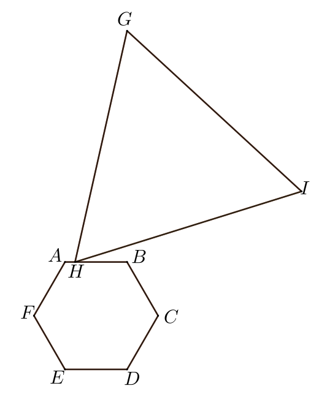

| A | B | C | D |
| :---: | :---: | :---: | :---: |
| $2\sqrt{3}\leq OI\leq 2\sqrt{7}$ | $2\sqrt{3}\leq OI\leq 3\sqrt{3}$ | $4\leq OI\leq 2\sqrt{7}$ | $4\leq OI\leq 3\sqrt{3}$ |

### 10.

如图，在三角形$ABC$中，$D$为$AB$边上一点，$\angle ADC=75^\circ$。$E$为$AC$边上一点，$\angle AEB=135^\circ$。若三角形$ABC$的面积为$3+\sqrt{3}$，$AE\cdot AC=4$，则$AD\cdot AB$的值为（　▲　）。

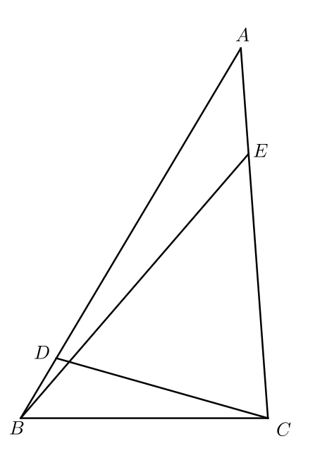

| A | B | C | D |
| :---: | :---: | :---: | :---: |
| $16$ | $\frac{16\sqrt{6}+7\sqrt{2}}{3}$ | $\frac{15\sqrt{2}+7\sqrt{3}}{2}$ | $17$ |

## 非选择题部分

## 二、填空题

（本大题共6小题，每小题3分，共18分）

### 11.

化简：$5(3m-2)-3(5m-7)=$ ______。

### 12.

在$\triangle ABC$中，若$\angle A+\angle B=3\angle C$，$\angle C=$ ______。

### 13.

如图，在直角三角形$BAC$中，$BA\perp AC$，且$\tan\angle C=\frac{3}{4}$。过点$B$作$DB\perp BC$，且$\angle BDA=120^\circ$，$\tan\angle DAB$的值为 ______。

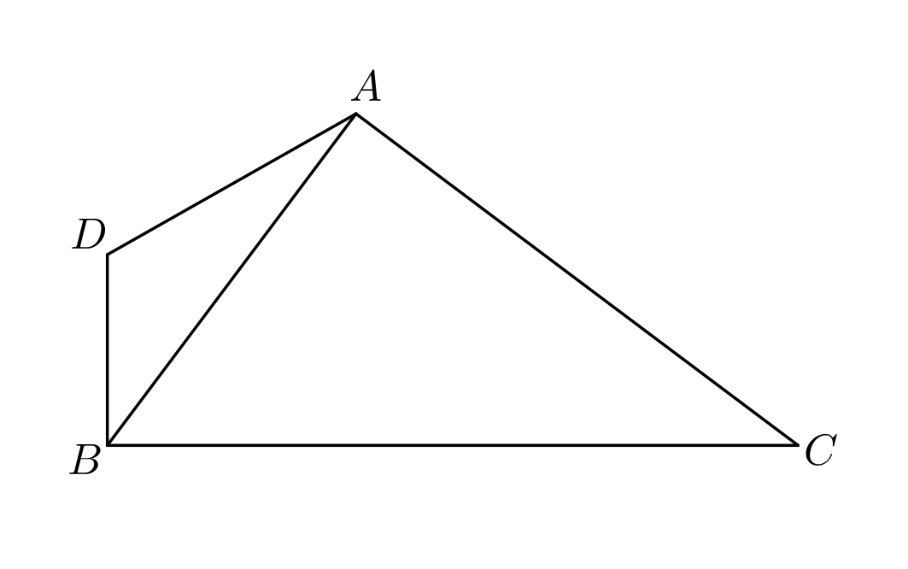

### 14.

如图，在直角三角形$ABC$中，$AB=2$，$BC=4$，$\angle ABC=90^\circ$。点$D$满足$\angle BAD+\angle DBC+\angle DCB=90^\circ$，且$\angle BAD=\angle DBC$。线段$DC$的长为 ______。

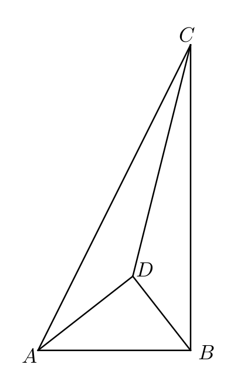

### 15.

已知命题：「方程$\frac{x-m}{x-2}+\frac{2x+m}{x+4}=4$仅有负数根」为假命题，实数$m$的取值范围为 ______。

### 16.

如图，在四边形$ABCD$中，$AB=AD=\sqrt{7}$，$CD=7$，$BC=11$。当四边形$ABCD$的面积取得最大值时，对角线$AC$的长度为 ______。

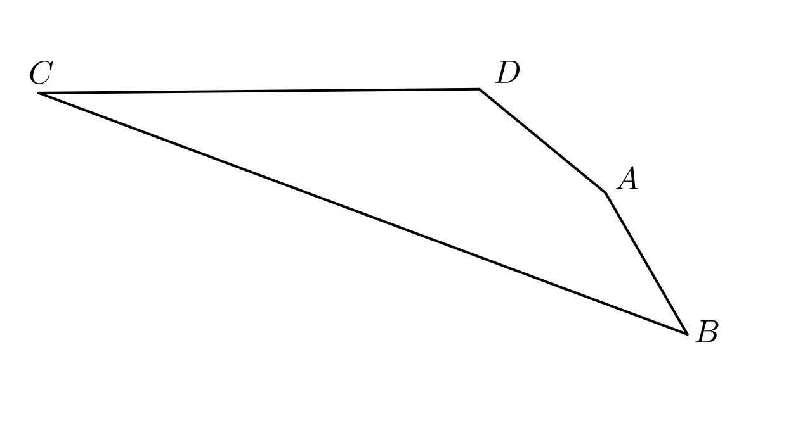

## 三、解答题

（本大题共8小题，共72分。解答应写出文字说明、证明过程或演算步骤）

### 17.（本题8分）

因式分解：$x^2-16$。

### 18.（本题8分）

解不等式组：

$$
\begin{cases}
3x+8\leq 29,\\
-2x+7<-1,
\end{cases}
$$

并将解集在数轴上表示出来。

### 19.（本题8分）

青少年体质健康是建设教育强国、体育强国和健康中国的重要基石。为深入贯彻《「健康中国2030」规划纲要》和新时代「五育并举」育人理念，浙江省各地中小学大力开展阳光体育活动，鼓励学生在课后积极参与科学化、常态化的体能锻炼。某日下午最后一节课后，小浙与小江积极响应学校「每天锻炼一小时」的倡议，相约前往标准化操场进行跑步训练。小浙于$t=0$时以$4\ \mathrm{m/s}$的速度从操场最内道起跑点出发，沿内道匀速绕圈奔跑；小江因做热身准备稍晚，在$t=0$时尚未起跑，直至2分钟后才以$3\ \mathrm{m/s}$的速度从同一地点同向出发。已知操场最内道一圈长为$400\ \mathrm{m}$，两人始终沿最内道匀速运动，可视为质点，且均在小浙开始运动15分钟时停止运动。如图1，$l_1$与$l_2$分别为小浙、小江的运动时的$s-t$图像（其中$s$表示从起跑点开始累计的路程，单位：米；$t$表示从小浙开始运动起计时的时间，单位：秒）。

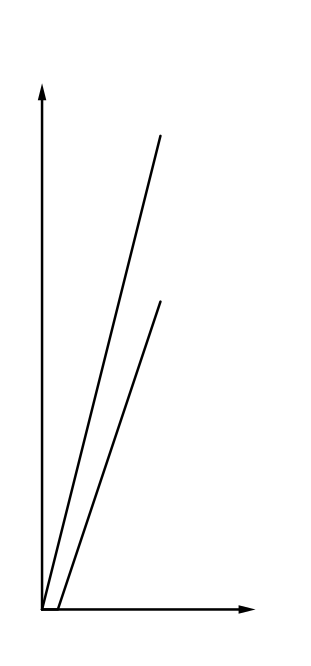

#### （1）

求$l_1$、$l_2$的函数表达式。

#### （2）

求从小浙开始运动到结束的过程中，小浙一共「套圈」小江多少次？（注：当两人位于操场上同一位置时，即视为一次套圈，无论小江是否已开始运动）

### 20.（本题8分）

生物学是一门探索生命现象与规律的自然科学，其研究内容涵盖生物体的结构与功能、个体发育、种群互动及生态系统等多个层面。该学科体系庞大，包含动物生理学、植物生理学、生态学、细胞生物学、分子生物学等诸多分支。在动物生理学中，神经信号的快速传递机制是一个重要课题。当人体感受到外界刺激（如触碰高温物体），神经系统会通过一种称为「动作电位」的电信号实现毫秒级响应。某中学生物兴趣小组对此开展模拟实验，记录了神经细胞受刺激后膜电位随时间的变化曲线（见图1）和不同刺激强度下的响应结果（见图2）。请你结合图像回答下列问题：

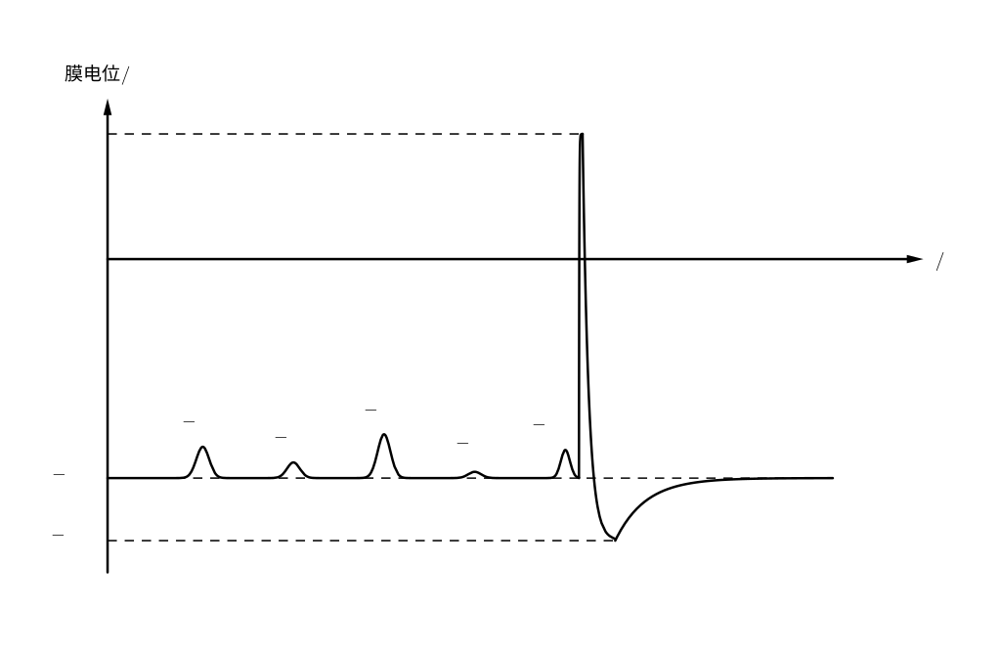

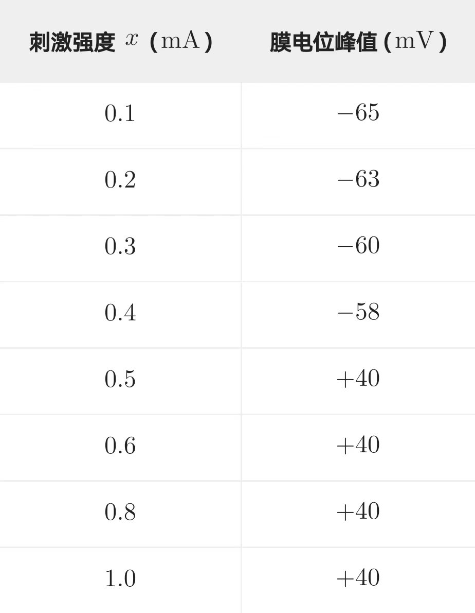

#### （1）

已知图1中动作电位$f$呈左右对称的波形，从静息电位$-70\ \mathrm{mV}$上升至峰值$+40\ \mathrm{mV}$所用的时间为$0.4\ \mathrm{ms}$。请计算其上升支的平均膜电位变化速率（单位：$\mathrm{mV/ms}$）。

#### （2）

图1中记录了$a$、$b$、$c$、$d$、$e$这5次阈下刺激引起的膜电位波动。请根据图1中给出的峰值数据，计算这5个峰值的平均值与方差。

#### （3）

参考图2，若用$x$表示刺激强度（单位：$\mathrm{mA}$），$y$表示是否产生完整动作电位（即膜电位峰值达到$+40\ \mathrm{mV}$）：当能产生时，记$y=1$；当不能产生时，记$y=0$。请直接写出$y$关于$x$的函数表达式。（$x=0.5$时，膜电位峰值恰好达到$+40\ \mathrm{mV}$）

### 21.（本题8分）

823班数学课上，数学何老师提出了一个概念：如果一个整数$a$满足$c=|a|-10b$，其中$b$为整数，且$0\leq c\leq 9$，则称$c$为$a$的「净尾数」，记作$/a/=c$。

#### （1）

请你求出$-15$的「净尾数」。

#### （2）

若$m-61-\frac{2176}{17}=97+63$，求$/m/$的值。

#### （3）

在标准化考试中，出题人常常精心构造数据，使得复杂问题存在「巧解」路径——这并非偶然，而是利用了数学结构中的隐藏规律，如尾数、奇偶性或同余特征。这种「结构洞察」能力，不仅在考场上有用，在真实世界中同样至关重要。例如，在密码学中，攻击者可能利用模运算或尾数特征快速排除无效密钥；在金融风控中，分析师通过数字的末位规律识别异常交易；在计算机算法优化中，程序员常借助同余、取模等技巧提升计算效率。这些都说明：善于从复杂系统中提取关键信息，是高效解决问题的核心素养。

现有一个由两个方程构成的整数解问题：

$$
\begin{cases}
54686562x+93245619y=476051553 & \text{①},\\
x+y=8 & \text{②}.
\end{cases}
$$

已知$x,y$均为正整数。小明同学尝试利用「净尾数」工具简化计算，其解答过程如下所示：

> 由②得$y=8-x$③。
>
> $\because x,y$均为正整数，
>
> $\therefore \begin{cases}x>0,\\8-x>0.\end{cases}$
>
> 解得$0<x<8$。
>
> 由①得$/2x+9y/=3$④。
>
> 将③代入④，化简并移项，得$/-7x+70/=2$，
>
> 即$/-7x/=2$，
>
> 由枚举法得$x=6$。

请判断小明的解答过程是否正确。若正确，请直接说明；若错误，请指出具体错误之处，给出正确解答，并说明如何规避此类问题。在此基础上，结合上述现实背景，谈谈我们在面对复杂问题时应如何合理运用「简化策略」与「结构洞察」，避免陷入机械计算或逻辑漏洞。

### 22.（本题10分）

折纸，作为中华优秀传统文化中的精微技艺，素来与书法、节庆相融共生。每逢新春，人们以红纸载福，笔走龙蛇，寄托对祥瑞安康的祈愿。为让学生在动手实践中感悟「方正有度」的书写之道——因传统「福」字常书于正方形红笺之上，取其「端正圆满」之意——某校数学备课组组长朱老师特设计此几何折纸活动：通过严谨的折叠操作，从长方形纸片中精准折出一正方形，既承古法之巧思，亦启数理之妙趣。她分享的好方法如下所示：

如左图，在长方形$ABCD$中，$AB<AD$。在边$AD$上取一点$E$，将$\triangle ABE$沿直线$BE$折叠，使点$A$的对应点$A'$恰好落在边$BC$上。

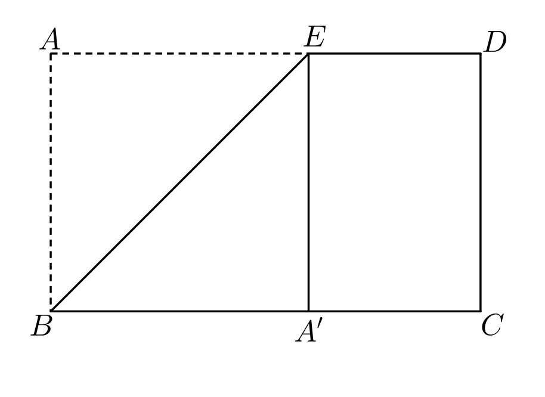

#### （1）

求证：四边形$AEA'B$为正方形。

#### （2）

某同学按上述方法折出一个正方形后，将其剪下；随后，他将剩余的长方形纸片再次按相同方式操作，又得到一个较小的正方形和一个新的长方形。已知最终所得小长方形的长和宽分别为$3$和$2$。若将两次剪下的两个正方形与该小长方形重新拼接，复原成与原长方形全等的大长方形时，求最大正方形的对角线中点与该小长方形对角线中点之间的距离。

#### （3）

若将剩余部分继续用同样方式处理——即反复从当前长方形中剪去一个最大的正方形——最终会得到一个正方形。这一过程，看似简单，却贯穿古今中外：古人分田划畦、裁缝剪布配流苏、今人折纸写「福」字，皆暗合此理。

为了帮助大家理解这一普适方法，阅读以下材料，完成以下小题。

##### 材料一

建初三年，会稽郡田曹掾谨奏：郡有官田一区，广三百六十步，袤四百八十步。今欲划为方畦，以便均溉省工，且令畦形正方，尺寸划一，毋使畸零。

臣按《九章算术》之法：「以少减多，更相减损，求其等也。」乃以广袤互减，凡减三次，得等数一百二十步。遂划为方畦，每畦百二十步见方，纵横各三与四，共得十二畦，地无遗寸，民称便焉。

制曰：可。

##### 材料二

在古希腊的集市上，一位裁缝有两块布料，一块长$117$厘米，另一块长$65$厘米。她想把它们都剪成完全相同长度的小段，用来做流苏，而且希望每段尽可能长，避免浪费。她正发愁要不要拿尺子一段段试，路过的欧几里得笑着说：「不用量！你用长的那块去比短的，看多出多少；再拿短的去比这个『多出来的』，一直比下去，直到刚好对齐——那个长度就是你要的！」她照着做了：$117$比$65$多$52$，$65$比$52$多$13$，$52$正好是$13$的$4$倍。于是每段剪成$13$厘米。她惊喜地说：「这方法真像我妈教我分丝线！」欧几里得点头：「数学不在天上，就在你手里的活计里。」

##### 材料三

对于两个正整数$a$和$b$，如果一个正整数$d$能同时整除$a$和$b$，就称$d$是它们的一个公因数。其中最大的那个，叫做最大公因数，记作$\gcd(a,b)$。

例如：$\gcd(15,9)=3$。

##### 材料四

求两个正整数的最大公因数，可用辗转相除法：

$$
\begin{aligned}
48\div18&=2\mathbin{\ldots\ldots}12,\\
18\div12&=1\mathbin{\ldots\ldots}6,\\
12\div6&=2\mathbin{\ldots\ldots}0,\\
\therefore\ \gcd(48,18)&=6.
\end{aligned}
$$

一般地，反复用大数除以小数，记录余数，再用除数除以余数，直到余数为$0$，此时的除数就是最大公因数。

一张长方形纸片长为$18272$厘米，宽为$384$厘米。每次剪去一个最大的正方形，直到剩下最后一个正方形为止。一共可以剪出多少个正方形？一般地，若长方形的长为$\frac{p_1}{q_1}$，宽为$\frac{p_2}{q_2}$（$p_1,q_1,p_2,q_2$为正整数），经过若干次「剪最大正方形」操作后最终得到一个正方形。试用$p_1,q_1,p_2,q_2$表示这个正方形的边长，并说明理由。

### 23.（本题10分）

已知二次函数$y=ax^2+bx+c$上有4点，分别为$A(x_1,y_1)$，$B(x_2,y_2)$，$C(x_3,y_3)$，$D(x_4,y_4)$。

#### （1）

若$a=3$，点$A$、$B$都在$x$轴正半轴上，且$x_1=1$，$OA=\frac{1}{4}OB$。

##### （i）

求该$y$的表达式。

##### （ii）

已知点$P(3,p)$，$y'=mx+n$经过点$P$且与$y$交于$C$、$D$两点，若$CP=DP$，试用含$p$的式子表示$y'$的表达式，并求出$p$的取值范围。

#### （2）

若$y_3=\frac{y_1+y_2}{2}$，有一直线$l$平行于$AB$，且恰好经过点$C$。求证：该直线$l$一定与$y$有两个交点。

### 24.（本题12分）

如图1，已知四边形$ABCD$内接于圆$O$，$AB\parallel CD$，且$AB<DC$。过点$A$作$AE\perp CD$交$CD$于点$E$，交圆$O$于点$F$。连接$OF$交$CD$于点$G$，有$DA=\sqrt{2}OF$。连接$DB$交$AF$于点$H$。过点$C$作$CI\perp DB$交$DB$于点$I$。取$AF$延长线上一点$J$，作平行四边形$DJKI$。过点$J$作$JL\perp AJ$交$BC$延长线于点$L$。连接$LK$，恰有$LK=JK$。

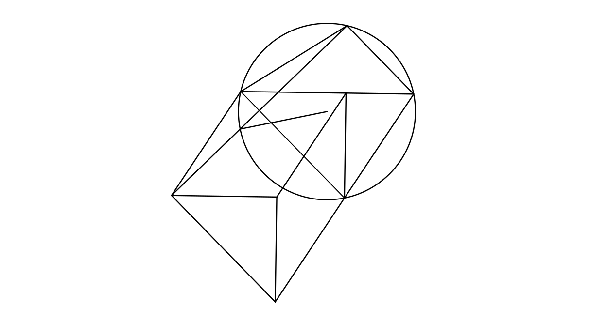

#### （1）

求证：$\triangle JKL\cong\triangle DIC$。

#### （2）

求$\frac{KI}{OL}$的值。

#### （3）

求证：$\angle CGL=\angle HLD+\angle FLJ$。

